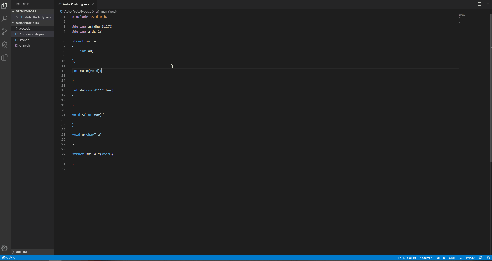
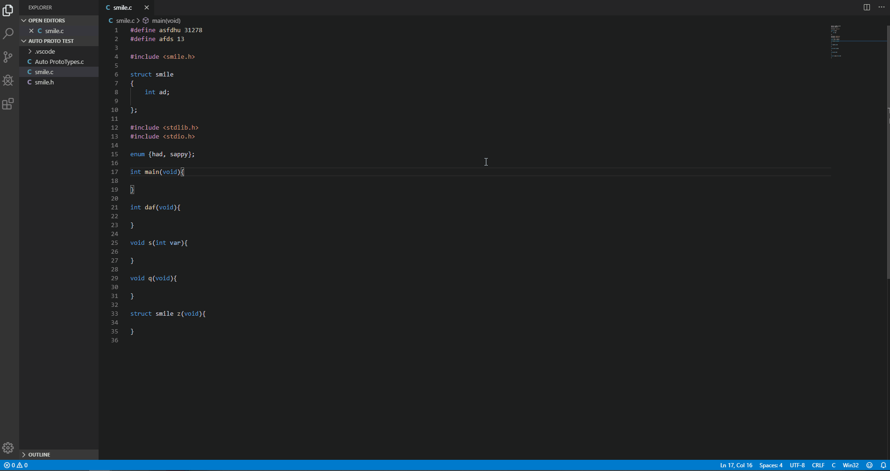

# C Auto Prototypes

## Features
Automate your prototypes in C today!

Use the hotkey alt+shift+Q to auto generate functions to the top of the file. Or if there is a header with the same name it will take everything above main and merge with the header.

### DEMO
The result without using a header:

And with using a header:
