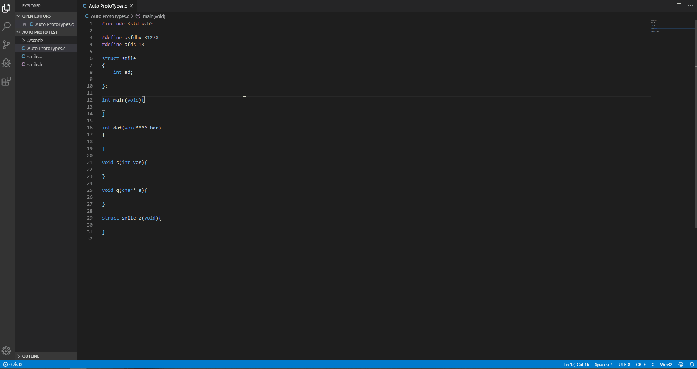
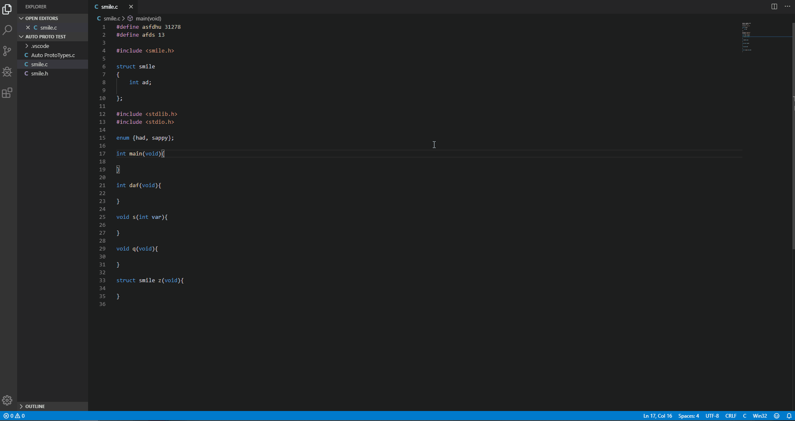

# C Auto Prototypes

## Features
Automate your prototypes in C today!

Use the hotkey alt+shift+Q to auto generate functions to the top of the file. Or if there is a header with the same name it will take everything above main and merge with the header.

If there are already prototypes it will update them accordingly, for example if the parameters for functions were updated.

It is also possible to enable or disable the header functionality if it to the users desire.

### DEMO
The result without using a header:

And with using a header:

## Disclaimer
This is made in my off time, therefore it may or may not be updated.